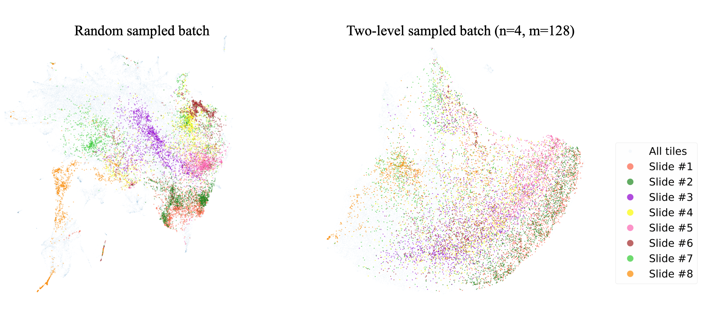

# Conditional Self-supervised for histopathology images

This repository contains the code for the paper [Interpretable Prediction of Lung Squamous Cell Carcinoma Recurrence With Self-supervised Learning]().

## Introduction
In this study, we explore the morphological features of LSCC recurrence and metastasis with novel SSL method, based on conditional SSL. We propose a sampling mechanism within contrastive SSL framework for histopathology images that avoids overfitting to batch effects. 

The 2D UMAP projection of tile representations, trained by different sampling
in self-supervised learning. Tiles from 8 slides with mostly LSCC tumor content
are highlighted with different colors. Left: model trained by MoCo contrastive
learning with uniform sampling. It shows that tiles within each slide cluster
together. Right: model trained with proposed conditional contrastive learning.
The tiles from each slide are less clustered together.

The Kaplan-Meier curves shows rates of recurrence-free patients over time in
sub-cohorts of test set with different criterion. Two sub-cohorts stratified with the predicted
recurrence risk by our Cox regression. The high risk cohort includes the top half
patients of highest estimated risks; the low risk cohort includes the lower half.

## Data 

### TCGA-LUSC
Download the TCGA-LUSC whole slide image from this [filter](https://portal.gdc.cancer.gov/repository?facetTab=files&filters=%7B%22op%22%3A%22and%22%2C%22content%22%3A%5B%7B%22op%22%3A%22in%22%2C%22content%22%3A%7B%22field%22%3A%22cases.project.project_id%22%2C%22value%22%3A%5B%22TCGA-LUSC%22%5D%7D%7D%2C%7B%22op%22%3A%22in%22%2C%22content%22%3A%7B%22field%22%3A%22files.data_format%22%2C%22value%22%3A%5B%22svs%22%5D%7D%7D%2C%7B%22op%22%3A%22in%22%2C%22content%22%3A%7B%22field%22%3A%22files.experimental_strategy%22%2C%22value%22%3A%5B%22Tissue%20Slide%22%5D%7D%7D%5D%7D). 

### CPTAC-LSCC
Download the TCGA-LSCC whole slide image from [here](https://wiki.cancerimagingarchive.net/display/Public/CPTAC-LSCC).

## Preprocessing

To preprocess the WSIs, run the code in preprocessing folder.

`python process_tcga.py --followup_path {followup_table} --wsi_path {directory_of_WSIs} --refer_img {color_norm_img} --s {proportion_of_tissue}`

`python process_cptac.py --followup_path {followup_table} --wsi_path {directory_of_WSIs} --refer_img {color_norm_img} --s {proportion_of_tissue}`

## Self-supervised learning

Run the command to train the Inception V4 with conditional SSL on two-layer sampling.

`torchrun train.py --data_dir {data_dir} --split_dir {annotation_dir} --batch_slide_num {number of slides in batch} --cos --out_dir {output_dir}`

## Extract features

To extract features, we first extract the tile representations with pretrained Inception V4.

`python extract_embeddings.py --feature_extractor_dir {checkpoint of pretrained feature extractor} --subtype_model_dir {subtype model} --root_dir {tiles directory} --split_dir {annotation files} --out_dir {output directory}`
